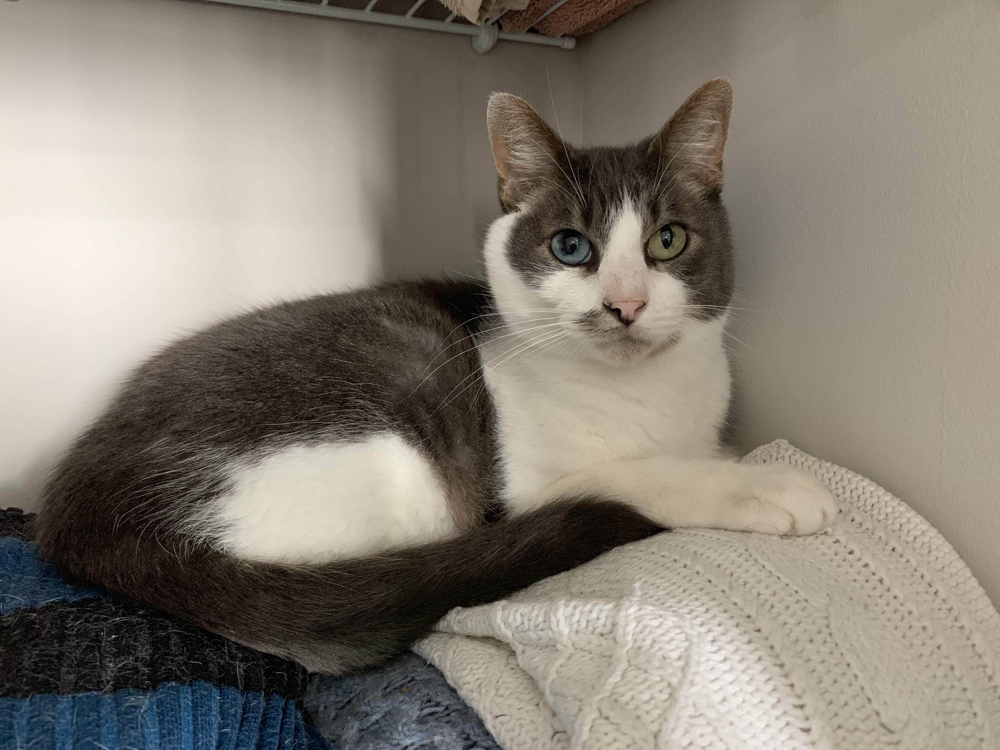

<div align="left">
**1. What is a Vietnamese tea ceremony?**

<div class="nobullet">
* The tea ceremony is the traditional wedding ritual performed in Vietnamese culture. The bride and groom pour tea for their parents and grandparents while receiving blessings or marital advice. Note that this portion of the ceremony is meant to be quite intimate, and guests are usually unable to hear what is spoken by the parents and grandparents. The ceremony concludes by pouring tea and burning 
incense in honor of deceased relatives of the bride and groom. 
</div>  
  
**2. What should we do when we arrive at the tea ceremony?**

<div class="nobullet">
* The family of the bride may arrive as early as 4:30 PM and gather inside the santuary. Family of the groom and any friends are asked to arrive by 5:00 PM and gather outside to form the procession. 
</div>

**3. How do we line up for the tea ceremony procession?**
<div class="nobullet">
* The procession is led by the grooms's male relatives carrying gifts for the family of the bride. They are followed by the groom, the rest of the groom's family, and finally, friends of the bride and groom. 
</div>

**4. Where do we sit for the tea ceremony?**
<div class="nobullet">
* The front row is reserved for immediate family members taking part in the ceremony. Otherwise, guests may take their seats wherever they like.
</div>


**2. What is the recommended attire?**

<div class="nobullet">
* For the wedding on Saturday, we recommend semi-formal: suits but not 
tuxes, and dresses that need not be floor length. 

* For the tea ceremony on Friday, we recommend "dressy casual": anything a step up from jeans. Also acceptable are ao dai, a traditional Vietnamese style of clothing.

* However, we hope that you will feel free to come as you are, whether that's jeans or your prom dress!
</div>

**3. Is any part of the celebration outdoors?**
<div class="nobullet">
* Yes, the wedding ceremony and cocktail hour will be held outdoors, barring any inclement weather.
</div>

**4. Who is Bishop?**

<div class="nobullet">
* Since you've made it this far, you must know the password to this site, and you might be wondering who Bishop is. Bishop is the cutest cat in Boston (and maybe the world). Here he is lying on his cat bed, also known as "Crystal's sweaters."
</div>

<center>
```{r bishop_photo, out.height="350px", out.width="525px", fig.alilgn="center"}

```

</div>

<div align="left">

**5. Will Bishop be at the wedding?**
<div class="nobullet">
* Unfortunately not. Bishop is a loving cat that would not last longer than five seconds outdoors.
</div>

**6. Where can I find parking?**
<div class="nobullet">
* The lodging options, tea ceremony church, and wedding venue all have ample parking available for free.
</div>

**7. Will transportation be provided?**
<div class="nobullet">
* This is still TBD, but we are hoping to find transportation to and from the hotel on both evenings for wedding guests!
</div>

**8. Can I bring a guest or my kids?**
<div class="nobullet">
* If their name is on the inner envelope of the invitation, they are most certainly welcome!
</div>

**9. How should I submit my RSVP?**
<div class="nobullet">
* You may RSVP online or by mailing back the RSVP card found in your invitation.
</div>

</div>

<br>

<br>

<br>

<br>

<br>
