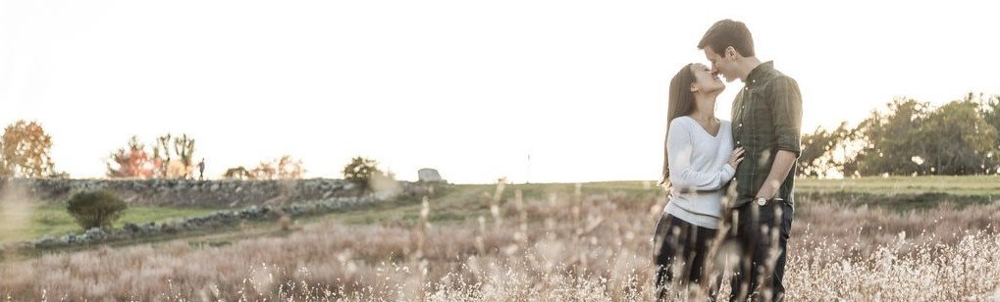
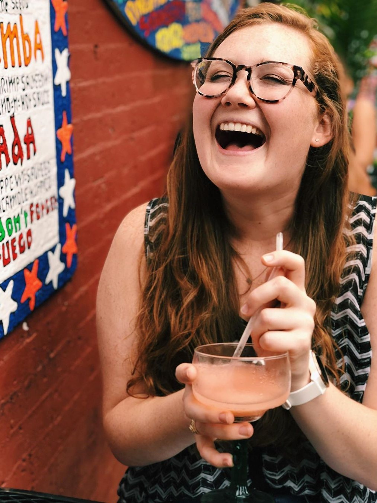
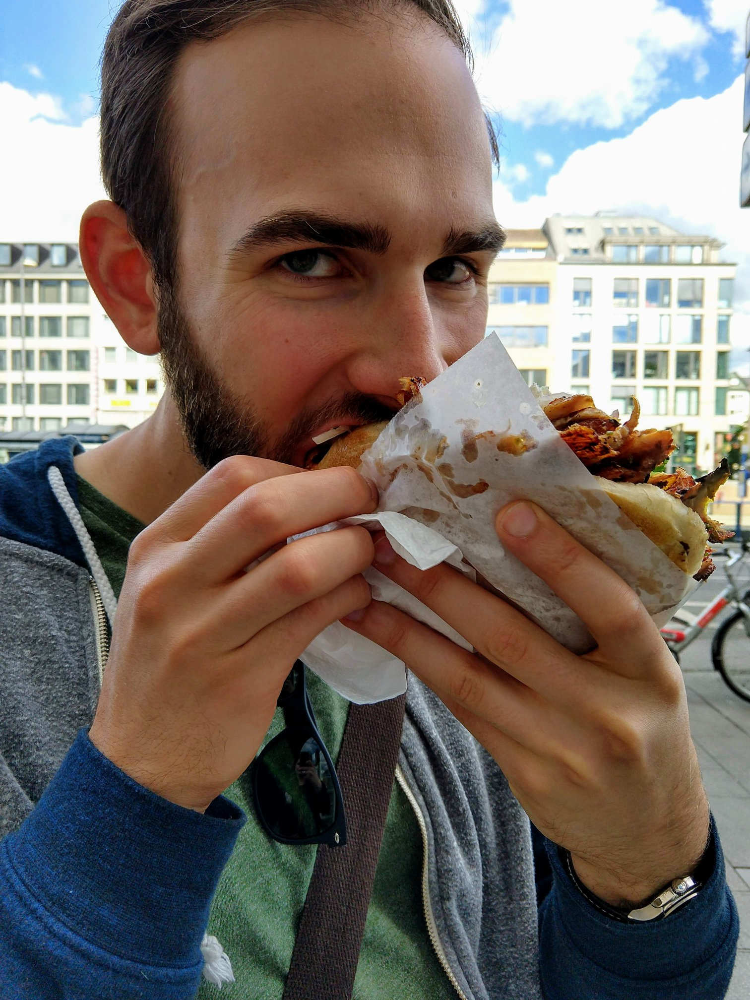
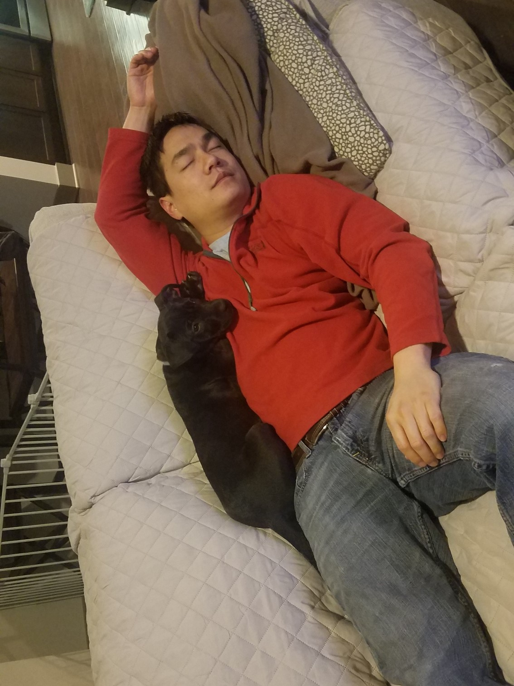
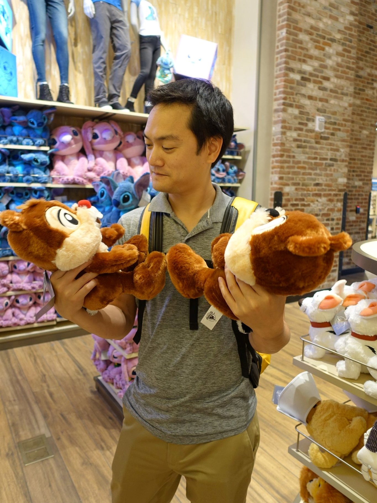
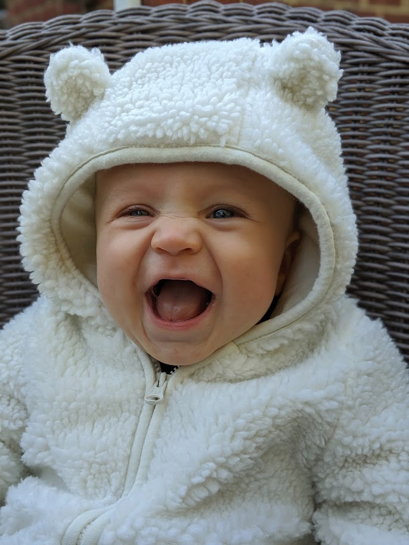

##### Crystal & Daniel
#### Are Getting Married!

Cypress, TX

2.27.2021


{width=100%}


#### About Us

In August of 2014 at the University of North Carolina, Crystal began her graduate studies in Biostatistics and met Daniel, who had entered the same program the year before she did. They took little to no notice of one another despite being in the same research group and having neighboring desks. One year later, being the former high school choir nerd that she is, Crystal enrolled in voice lessons and was in need of an accompanist. Lucky for her, labmate Daniel was quite the talented pianist. It wasn't long before Crystal and Daniel were regularly headed out to practice rooms for jam sessions with music genres ranging from opera and musical theatre to pop. 

An entire year later, Crystal and Daniel discovered another shared passion: street tacos. By now, Crystal realized she had a pretty big crush on Daniel. That evening, Daniel and Crystal found themselves headed out for some spontaneous late night tacos. Now on the one hand, this was excellent news. Was Daniel interested? Maybe! On the other hand, Crystal had just eaten a massive burrito for dinner and had little to no appetite for any more food for perhaps another 4.5 days. But she couldn't back out ___now___! After (begrudgingly) eating just one taco, Crystal and Daniel spent about four hours in the university quad playing guitar and singing duets. Can you say "dreamy?" When they finally went home, Crystal was on cloud 9, and Daniel thought to himself "Wow, I just spent a pretty long time with this girl. I guess that wasn't so bad." Eventually, "not so bad" turned into something more, and their relationship officially launched on 09/20/2016 with music, tacos, and swing dancing.

Daniel and Crystal's ensuing relationship achieved 1 ER visit, 2 perforated eardrums, 3 more years of grad school misery/accomplishments, and countless late nights of playing music in the park. After they both graduated with their doctorate degrees, Daniel and Crystal made a big move up north to Boston, MA for their first big kid jobs. When their 3rd anniversary came around, they made plans to visit Cape Cod (or "the Cod," as Crystal accidentally calls it). 

They headed out to the beach just before sunset with guitar in hand. After a few duets, Daniel serenaded Crystal with an original song. As if that wasn't romantic enough, he then pulled out their "Adventure Book," a scrapbook of their relationship. He had added pages for a number of events that had occurred since the scrapbook's last update. The last page of the book was bare except for a caption, which read "9/21/2019: The day you said 'yes!'"  


<br>

```{r, echo=FALSE}
htmltools::tags$iframe(
    src="timecounter.html",
    width="200", 
    height="100",
    seamless="seamless", 
    frameBorder="0"
  )
```

####  The I Do Crew

<div class = "row">
<div class = "col-md-3">
**Casey**
{width=100%}
</div>
<div class = "col-md-3">
**Michael**
</div>
<div class = "col-md-3">
**Anna**
{width=100%}
</div>
<div class = "col-md-3">
**Nuvan**
{width=100%}
</div>
</div>


<div class = "row">
<div class = "col-md-3">
**Jonathan**
{width=100%}

</div>
<div class = "col-md-3">
**Jonathan**
{width=100%}
</div>
<div class = "col-md-3">
**Joshua**
{width=100%}
</div>
<div class = "col-md-3">
**Barbara**
</div>
</div>

<div class = "row">
<div class = "col-md-4">
<p hidden>This paragraph should be hidden.</p>
</div>
<div class = "col-md-4">
**Graham**

{width=75%}
</div>
<div class = "col-md-4">
<p hidden>This paragraph should be hidden.</p>
</div>
</div>
