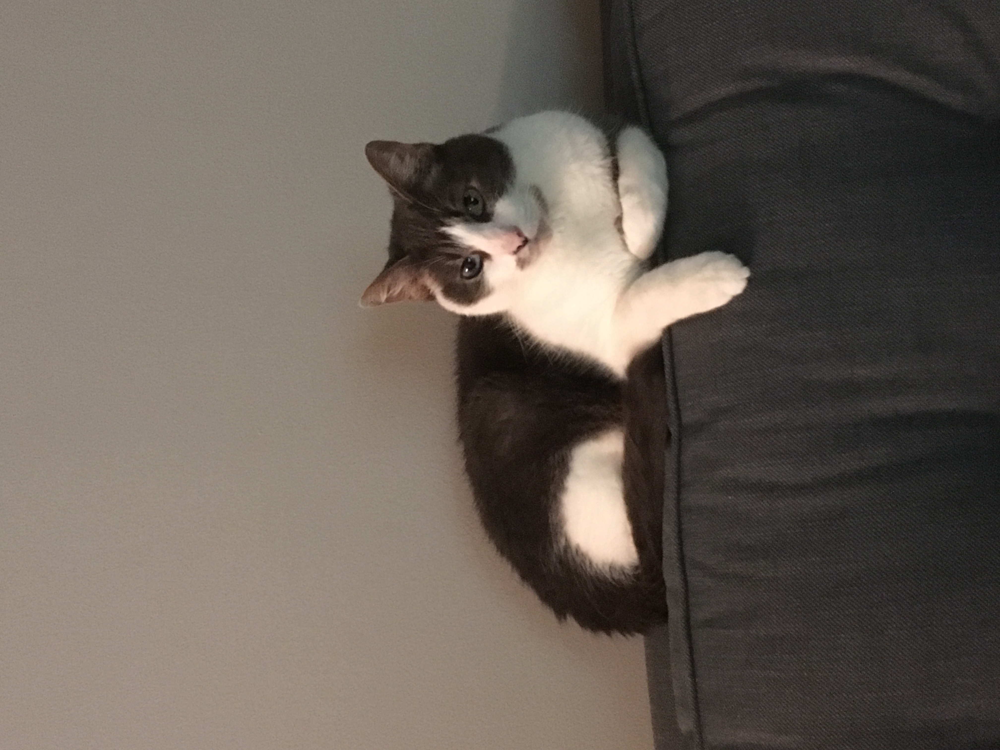

<style>      
/* define new fonts */
@font-face {
  font-family: 'Alex Brush';
  font-style: normal;
  font-weight: 400;
  src: local('Alex Brush Regular'), local('AlexBrush-Regular'), url(https://fonts.gstatic.com/s/alexbrush/v11/SZc83FzrJKuqFbwMKk6EhUXz7Q.woff2) format('woff2');
}
@font-face {
  font-family: 'Amatic SC';
  font-style: normal;
  font-weight: 400;
  src: local('Amatic SC Regular'), local('AmaticSC-Regular'), url(https://fonts.gstatic.com/s/amaticsc/v13/TUZyzwprpvBS1izr_vOECuSf.woff2) format('woff2');
}
@font-face {
  font-family: 'Rajdhani';
  font-style: normal;
  font-weight: 400;
  src: local('Rajdhani Regular'), local('Rajdhani-Regular'), url(https://fonts.gstatic.com/s/rajdhani/v9/LDIxapCSOBg7S-QT7p4HM-Y.woff2) format('woff2');
}
@font-face {
  font-family: 'Blancha Regular';
  font-style: normal;
  font-weight: normal;
  src: local('Blancha Regular'), url('Blancha.woff') format('woff');
}


/* define colors for navigation bar */
.navbar, [data-toggle=tab], .navbar-brand{ 
  background-color:#003366!important; 
  border-color:#003366; 
  color:white!important; 
  font-family: Zeyada;
  font-size: 16pt;
  text-align: center;
  display: inline-block;
}
/* define colors for something */
.bgred {
  background-color:#003366;
  color:white;
}


/* define font for headers */
h4{
  font-family: Blancha Regular;
  font-size: 64pt;
  color: #b76e79;
  /* font-style: italic; */
}
h5{
  font-family: Zeyada;
  font-style: normal;
  font-size: 24pt;
  color: #003366;
}
h6{
  font-size: 18 pt;
  font-style: bold;
}
/* center text on all tabs */
body{
  text-align: center;
}
/* define a new class of lists without bullet points */
.nobullet li {
  list-style-type: none;
  font-size: 10pt;
  color: gray;
  font-style: normal;
}
</style>       

```{r setup, include=FALSE}
library(flexdashboard)
library(htmltools)
```

Home {data-orientation=columns}
=======================================================================

Row {data-height=500}
-----------------------------------------------------------------------

<center>
##### The Adventure Begins for 

#### Crystal  &  Daniel


```{r engagement_photo}
knitr::include_graphics("../engagement.JPG")
```

##### Cypress, TX
##### 2.27.2021

```{r, echo=FALSE}
htmltools::tags$iframe(
    src="timecounter.html",
    width="200", 
    height="100",
    scrolling="no", 
    seamless="seamless", 
    frameBorder="0"
  )
```

##### About the Couple

###### Two columns, one for Daniel, one for Crystal. Headshot and short blurb

##### The I Do Crew

###### Headshots for each. VIPs on own line. Remaining on one line. Graham gets his own? Name and a quick one liner, e.g., Casey Gilbert, Crystal's friend since the 5th grade


Events {data-orientation=columns}
=======================================================================

#### More information coming soon!

Travel
=======================================================================

#### More information coming soon!

Registry
=======================================================================

#### More information coming soon!

RSVP
=======================================================================

#### Link to google form here

Gallery
=======================================================================

#### More information coming soon!

FAQs
=======================================================================

##### Frequently Asked Questions

<div align="left">
###### 1. What is a Vietnamese tea ceremony?

<div class="nobullet">
* This is a great question! I don't really know either, but I'll have Crystal fill in this section when she gets a chance.
</div>

###### 2. What is the recommended attire?

<div class="nobullet">
* Daniel will be wearing a suit. Crystal will be wearing a floor-length dress. We are recommending "dressy casual" to the Tea Ceremony and semi-formal to the wedding on Saturday. To us, dressy casual means anything that isn't jeans, and semiformal means ties without tuxes and dresses that don't have to be floor length. However, we hope that you will feel free to come as you are!
</div>

###### 3. Are my kids invited? 

<div class="nobullet">
* If their name is on the inner envelope of the invitation, they are most certainly welcome!
</div>

###### 4. Who is Bishop?

<div class="nobullet">
* Since you've made it this far you must know the password to this site, so you might be wondering who Bishop is. Bishop is the cutest cat in Boston (and maybe the world). Here he is lying on his cat bed, also known as, "Crystal's sweaters."
</div>

<center>
```{r bishop_photo, out.height="350px", out.width="350px", out.extra="style='transform:rotate(90deg);'", fig.alilgn="center"}

```

</div>

DIY Wedding Blog
=======================================================================

<div align="justify">

#### More information coming soon!

##### deciding on creating our website this way to reflect "us." Maybe some other how tos on how it is we got this all to work in a manner that NONE of the software was intended to be used.

##### First blog: just getting started, what is the point of this blog, a cute story about us

</div>