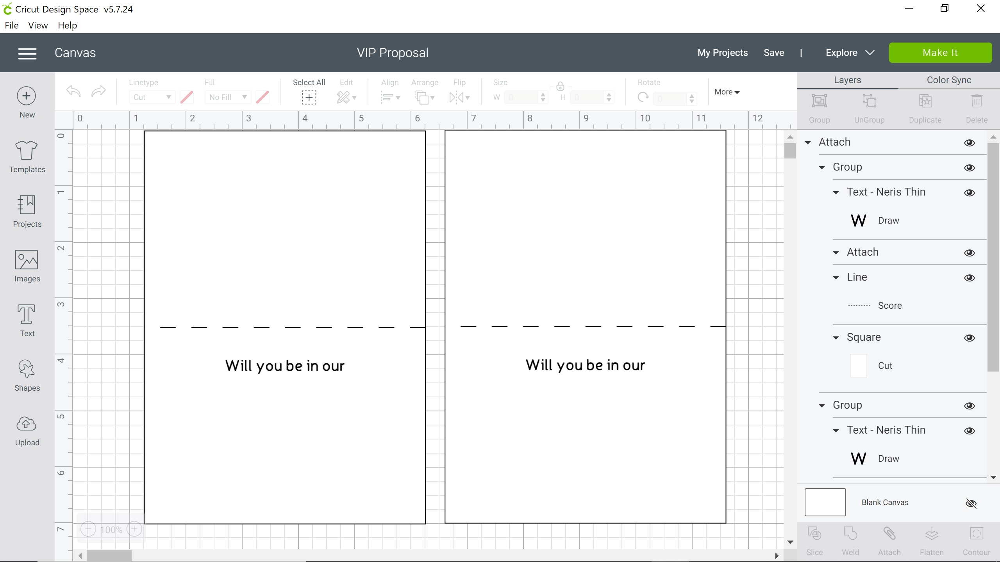
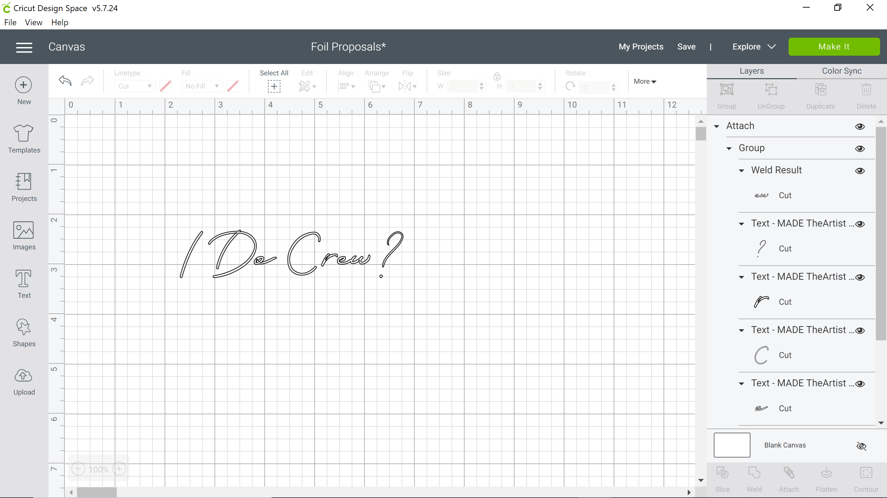
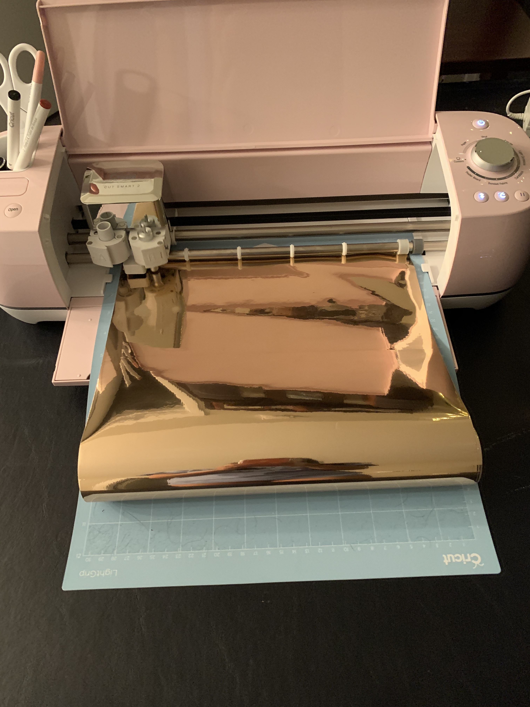
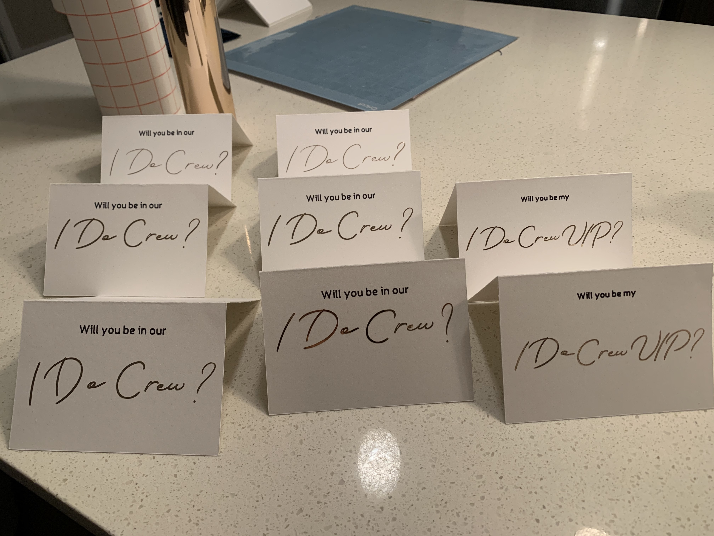

<style>
/* define new fonts */
@font-face {
font-family: 'Neris Thin';
font-style: normal;
font-weight: normal;
src: local('Neris Thin'), url('Neris-Thin.woff') format('woff');
}
@font-face{
    font-family: 'TheArtist';
    src: local('TheArtist'), url("TheArtist.woff") format("woff");
}
span.font1{font-family:"TheArtist";font-size:40px;text-transform:none;}

/* define colors for navigation bar */
.navbar, [data-toggle=tab], .navbar-brand{ 
  background-color:#003366!important; 
  border-color:#003366; 
  color:white!important;
  font-size: 16pt;
  display: inline-block;
  font-family: Neris Thin;
}

/* define colors for current tab */
.navbar-nav > .active > a {
  background-color:#003366!important;
  border-color:#003366;
  color:#b76e79!important;
  font-size: 16pt;
  display: inline-block;
  font-family: Neris Thin;
  font-weight: bold;
}

.nav-tabs-custom > .nav-tabs > li.active {border-top-color: #b76e79}


/* define colors for hovering */
.navbar-nav li a:hover {
  background-color:#003366!important;
  border-color:#003366;
  color:#b76e79!important;
  font-size: 16pt;
  display: inline-block;
  font-family: Neris Thin;
}
/* define colors for something */
.bgred {
  background-color:white !important;
  color:white !important;
}
body{
  text-align: center;
  width: 900px;
  margin: auto;
  font-size: 14pt;
  font-family: Neris Thin;
}

h3{
  color: #003366;
  font-size: 24pt;
}
h4{
  font-style: normal;
  font-size: 24pt;
  color: #003366;
  font-family: Neris Thin;
}
h5{
  font-size: 96pt;
  color: #b76e79;
  font-family: TheArtist;
}
h6{
  font-style: normal;
  font-size: 18pt;
  color: #003366;
  font-family: Neris Thin;
}
.nobullet li {
  list-style-type: none;
  font-size: 14pt;
  color: gray;
  font-family: Neris Thin;  
}

</style>

```{r setup, include=FALSE}
library(flexdashboard)
library(htmltools)
library(gallerier)
```

Home
================================================

<br>

```{r Home, child = 'Home.Rmd', eval = TRUE}
```


<!-- Events {data-orientation=columns} -->
<!-- ======================================================================= -->

<!-- #### Events -->

<!-- <br> -->
<!-- <br> -->

<!-- ```{r Events, child = 'Events.Rmd', eval = TRUE} -->

<!-- ``` -->

Details
=======================================================================

#### Details

<br>
<br>

```{r Travel, child = 'Travel.Rmd', eval = TRUE}


```


Registry
=======================================================================

#### Wedding Registry

<br>
<br>

We are registered at [Amazon.com](https://www.amazon.com/wedding/share/TheLuckettest){target="_blank"} and [Crate & Barrel](https://www.crateandbarrel.com/gift-registry/crystal-nguyen-and-daniel-luckett/r6097152){target="_blank"}. 

We ask that there be no boxed gifts brought to the wedding. It sure would be difficult to bring gifts home with us to Boston! Both registries will allow you to ship directly to us. A box will be available at the reception for any cards.


RSVP
=======================================================================

#### Repondez S'il Vous Plait
```{r, echo=FALSE, message=FALSE}
library(plotly)
# source('make_rsvp_plot.R')
p <- readRDS('rsvp.rds') %>%
layout(height = 250)
p
htmltools::tags$iframe(
    src="RSVP.html",
    width="750",
    height="1600",
    seamless="seamless",
    frameBorder="0"
  )
```

Gallery
=======================================================================

#### Gallery

<br>
<br>

```{r Gallery, child = 'Gallery.Rmd', eval = TRUE}

```

FAQs
=======================================================================

#### Frequently Asked Questions

<br>
<br>

```{r FAQ, child = 'FAQ.Rmd', eval = TRUE}
```

DIY Wedding Blog
=======================================================================

#### A Do It Yourself Wedding Blog

<br>
<br>

<!-- ```{r Blog, child = 'Blog.Rmd', eval = TRUE} -->
<!-- ``` -->

<!-- Inputs {.sidebar} -->
<!-- ------------------------------------- -->
<!-- hello world -->

Column {.tabset data-height=5000}
-------------------------------------

### 11/23/2019
###### I Do Crew Proposal Cards

11/23/2019

You may have noticed we don't have an equal number of groomsmen and bridesmaids on our main page of this website. We've opted to just call our wedding party an "I Do Crew." This decision was made for a few different reasons, but, primarily, we didn't want to have to fight over who got to stand on whose side just because of gender. Each member of this incredible crew is friend or (future) family to us both. At the end of the day, we know they are not rooting for just one of us, but for the both of us in our marriage. 

Okay, I'm done being sappy - onto the crafts. I took this project on to (1) be cutesy and (2) to test a couple of crafting techniques that I was hoping to use on later paper crafts for our wedding. 

What the heck is a proposal card? Just a little greeting card, sent in the mail or in person, to "propose" that a person be in your wedding party. Basically, one of those Hallmark industry made up things, but it's pretty hard for me to turn down a DIY opportunity. We went through a few drafts to get the process down as well as the aesthetic/vibe we were going for. We ultimately decided to personalize each card with a handwritten message. Because we were leaving the inside blank, the project became a lot easier from a crafting perspective. 

<div align="left">
<div class = "row">
<div class = "col-md-6">
Single use supplies:

* Adhesive Foil 
* Transfer Tape 
* 8.5" x 11" Medium-Heavy Weight Cardstock
</div>
<div class = "col-md-6">
Cricut supplies:

* Explore Air 2 or Maker 
* Scoring Stylus
* Fine Point Pen, Black
* Fine Point Blade
* Light Grip 12x12 Mat
* Basic Tool Set
</div>
</div>
</div>

We chose to use some free fonts we found on [dafont.com](https://www.dafont.com/){target="_blank"}: Made The Artist Script and Neris Thin. These fonts are used throughout our website and will be used on forthcoming wedding stationary. Once downloaded and installed, these fonts are available in the Cricut Design Space software that is associated with Cricut machines, as well as all your other text editor software. 

Designing the card itself is fairly simple. A rectangular shape creates the cut outline, the line across the middle is set to "score," and the text, "Will you be in our" is set to draw. I typically find that the custom material setting on the Cricut works better than any of the presets. In the software, I then select the appropriate material (medium cardstock here), and the software then guides you through which tool is needed when (fine point pen, scoring stylus, or fine point blade) for you to switch out and continue. I found the light grip mat to work better than a standard grip; the standard was too sticky and would leave most of my cardstock still stuck to the mat after trying to remove it.

{width=50%}

Working with the adhesive foil was only about 50 times harder. First off, when cutting a material into cursive text, you must manually place the letters to get the letters to connect as though written with a single pen stroke. The "weld" option in Cricut Design then tells the machine to treat all the words as a single object rather than independent letters (so you get "hello world" as opposed to "h e l l o  w o r l d"). 

{width=50%}

Here I again used custom material and selected adhesive foil. Definitely use a light grip mat, as the foil is a much daintier medium. Unfortunately, the Cricut brand metallic foils are not very sticky, making them very difficult to transfer. The foil comes with a paper backing, similar to stickers that are sold on wax paper. The Cricut adhesive foil setting knows to cut very lightly, only cutting the foil and not all the way through the backing as well. You then have to "weed" the cut foil, i.e., remove all the background parts surrounding the letters (the holes in the letters "e" and "o") without removing tiny pieces (punctuation, the dot on the letter "i"). I won't lie, this part was the worst. 

{width=50%}

BUT it was definitely worth it. Finally, you have to carefully use transfer tape to relocate the letters from the wax paper to the cardstock. Again, the foil is not that sticky, causing the letters to move around on accident and no longer having that cursive writing effect. 

{width=50%}

I'm pretty happy with how they came out, even if they're not all that uniform. Things I learned for when we do a similar process for the invitations: slow and steady keeps all your foil letters intact, print out excess periods for when you lose the dots for the letter "i," and always always make extras!


<br>
<br>
<br>
<br>


### 10/15/2019


###### Welcome & How to Host a Website Using flexdashboard and GitHub Pages

10/15/2019


Hello, friends and family! 

I am dedicating this blog to all things DIY that Daniel and I work on throughout the wedding planning process. This will include, but may not be limited to, I Do Crew proposals, invitations, gifts, and even the very website you are reading from now. I don't expect all or even any of you to find this remotely interesting, but maybe you will! At the very least, I wanted to document the neat things we come up with and describe how to do them in case other crafty couples wanted to learn from our successes and our mistakes.

If you didn't already know, I really love crafting. The process of taking raw materials and creating something appreciable brings me great joy whether it's baking, wood crafting, or scrapbooking. Until recently, I have always been a busy student without a lot of time available for crafting. However, I now work that wonderful 9-5 and, better yet, have an occassion to take on some really great crafting projects: our engagement! 

<center>
```{r engagement_photo_filtered, out.height="350px", out.width="350px",  fig.alilgn="center"}
knitr::include_graphics("../engagement_filtered.JPG")
```

When we first sat down to discuss the vision of our wedding and what experience we wanted to walk away with, we agreed that we wanted our personality as a couple to really shine through the decisions. Rather than purchasing all of our wedding "stuff," we figured we could save a few bucks by doing some of it ourselves. Moreover, we could better tailor our products when building our wedding brand to be the same across everything we distribute, starting with our wedding website.

We are, like many other engaged couples, using sites like WeddingWire and theknot in the planning process, but we just weren't satisfied with the options for creating a wedding website. We couldn't get the exact colors we wanted on all the website elements, there weren't a lot of options for fonts, and, most of all, <b>the data format of the guest list and RSVP form were not conducive to analysis</b>. This last point probably sounds really silly, but it was a deal breaker for us. 

As a data scientist and research analyst by trade, Daniel and I could not stand the thought of willingly creating a guest list that was not easy to manipulate in data analytic software. With my background in creating flexdashboards in [R](https://www.r-project.org/){target="_blank"} and Daniel's experience with collaborative version control in [GitHub](https://github.com){target="_blank"}, we knew there had to be a way to get this done. Now, this is most certainly <strong>not</strong> the most intuitive way to create a website. It definitely isn't the easiest (trust me, we did a pretty thorough search for web hosting options through R). Most web developers would use HTML programming, not statistical programming, but it's what we know! 

So, without further ado, how the heck does one create a website using a language not conventional for building a website (rivetting, I know)? First off, I would describe R as a great tool for anyone looking to be a data scientist or analyst. The software is free to download and completely open source, making it an ideal sandbox for data junkies like Daniel and me. More recently, R's capabilities in making dashboards for data visualization has become quite popular (see [here](https://rmarkdown.rstudio.com/flexdashboard/examples.html){target="_blank"} for examples). Some of these kinds of dashboards (flexdashboards) can produce html output, a file format you can easily save and send to others, and it will open and function conveniently for them.

But we want a website: a URL that guests can search for in their browser, not a file we have to email to all of our guests individually! [GitHub Pages](https://pages.github.com/){target="_blank"} to the rescue. GitHub is a place where you can practice version control -- it's like the track changes feature on a Google document but for any file that you may be making frequent edits to. GitHub Pages lets you upload the html file you may have, and it will host that file as a functioning website with a domain name of your choosing. Other sites and apps like Google Drive actually let you do this as well, but GitHub is a great, free option when multiple people are working together on the same project.

So we got to work. Daniel picked up some flexdashboard experience, and I got the hang of GitHub. We both had to learn a small amount of HTML programming, but we got this project up and running within a matter of hours. That's pretty quick as far as collaborative deliverables go! 

You may have noticed that our website is password protected. It was important to us to maintain some level of privacy. The free version of GitHub is intended for open access, encouraging collaboration and easy distribution of content and ideas. You can follow [these instructions](https://github.com/matteobrusa/Password-protection-for-static-pages){target="_blank"} to implement password protection on <strong>any</strong> website. It was super easy. You basically just have to know how to create and rename a folder, and you're set.

We still have a ways to go. Not all of our tabs are set up. We'll need to link our RSVP page to a Google form to collect RSVPs. Who knows if the site will be horribly slow once we add photos to the gallery. Maybe I'll post an update later as to how it goes. Thus far, it's been just a really fun, nerdy bonding activity for us.

Again, this was definitely not the most convenient way to create and host a wedding website, but this was absolutely the only way for Daniel and I to go about creating and hosting ours. Not only did it allow for complete customization of the end product, but building our website from the ground up in our preferred programming language has already been the ultimate kick off to our engagement. We both love data and programming in R; why not incorporate that into our wedding? My favorite part of building our website this way is that it is just totally novel. Flexdashboards are typically purposed for displaying visuals for data, not as a media for wedding information, but this challenge was merely an exciting puzzle for two nerds to solve. 

That's all for now. Stay tuned for how-tos, details, tips, and inspiration for DIY wedding projects.


<br>
<br>
<br>
<br>


