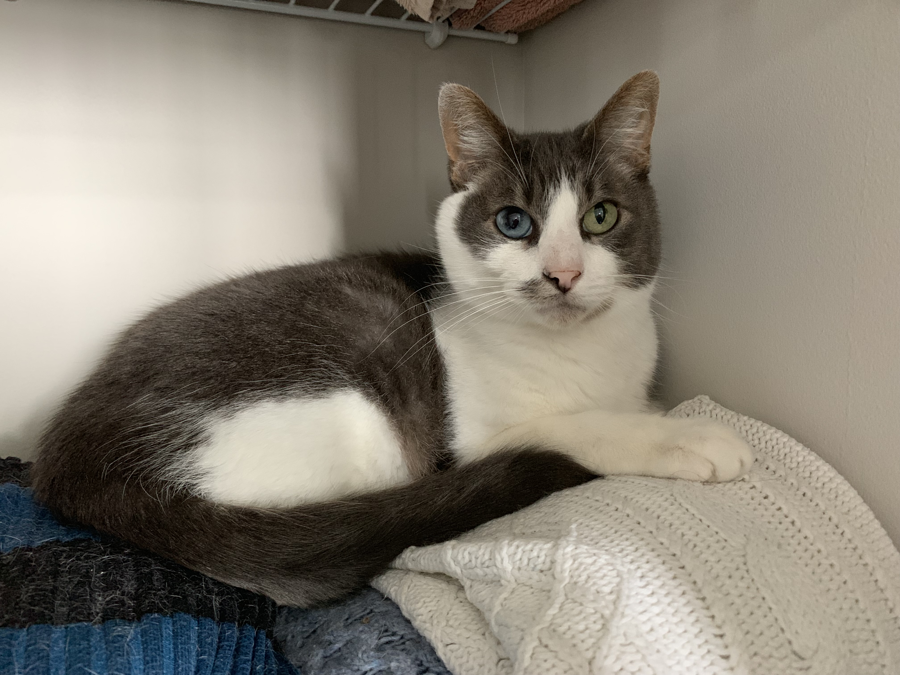

<style>
/* define new fonts */
@font-face {
font-family: 'Neris Thin';
font-style: normal;
font-weight: normal;
src: local('Neris Thin'), url('Neris-Thin.woff') format('woff');
}
@font-face{
    font-family: 'TheArtist';
    src: local('TheArtist'), url("TheArtist.woff") format("woff");
}
span.font1{font-family:"TheArtist";font-size:40px;text-transform:none;}


/* define colors for navigation bar */
.navbar, [data-toggle=tab], .navbar-brand{ 
  background-color:#003366!important; 
  border-color:#003366; 
  color:white!important;
  font-size: 16pt;
  display: inline-block;
  font-family: Neris Thin;
}
/* define colors for something */
.bgred {
  background-color:white !important;
  color:white !important;
}
body{
  text-align: center;
  width: 900px;
  margin: auto;
  font-size: 14pt;
  font-family: Neris Thin;
}


h3{
  color: #003366;
  font-size: 24pt;
}
h4{
  font-style: normal;
  font-size: 24pt;
  color: #003366;
  font-family: Neris Thin;
}
h5{
  font-size: 96pt;
  color: #b76e79;
  font-family: TheArtist;
}
h6{
  font-style: normal;
  font-size: 18pt;
  color: #003366;
  font-family: Neris Thin;
}
.nobullet li {
  list-style-type: none;
  font-size: 14pt;
  color: gray;
  font-family: Neris Thin;
}

</style>

```{r setup, include=FALSE}
library(flexdashboard)
library(htmltools)
```

Home
================================================

<br>

##### Crystal & Daniel
#### Are Getting Married!

Cypress, TX

2.27.2021


{width=80%}


#### About Us

Daniel and Crystal met in August of 2014 at the University of North Carolina (UNC). Daniel began his graduate studies in 2013, and, when Crystal arrived on campus the following year, they took little to no notice of one another despite being in the same lab group under the same advisor and having neighboring desks. One year later (Fall semester of 2015), former high school choir nerd Crystal decided to enroll in voice lessons. Naturally, she needed an accompanist. Lucky for her, labmate Daniel received a Bachelor of Arts in music performance on the piano! It was not long before Crystal and Daniel were headed out to practice rooms on the regular for "jam sessions" with music genres ranging from opera to musical theatre to pop. 

Soon after these jam sessions began, Crystal developed a big, fat crush on Daniel. Cute, nerdy, AND encourages shameless Disney karaoke? Who could resist? Daniel. Daniel could resist. After an ENTIRE YEAR of extensive Disney song playing, Crystal and Daniel had a discussion on street taco cravings. On one lucky evening in September 2016, Crystal half-jokingly texted Daniel, asking if he was interested in late night tacos. To her great surprise, Daniel agreed. Now on the one hand, this was excellent news. Was Daniel interested? Maybe! On the other hand, Crystal just ate a massive burrito for dinner and had little to no appetite for any more food for perhaps another 4.5 days. But she couldn't back out ___now___! 

That evening, Crystal went out and ate exactly one taco full of regret. Daniel and Crystal then spent about four hours in the University quad in a new kind of jam session -- with Daniel on duet vocals and playing guitar. Can you say "dreamy?" When they finally went home, Crystal was on cloud 9, and Daniel was saying to himself "I just spent a pretty long time with this girl. That wasn't so bad." 

Eventually, "not so bad" turned into something more. Crystal put the ball clearly in Daniel's court (for details, ask her to tell the story about the guy she ___thought___ she was in a relationship with but actually wasn't!). For those of you who don't know her, subtlty is not a strong point for Crystal. Daniel caught on -- it was hard not to -- and he soon confessed his "something more" feelings and launched their official relationship. 

Daniel and Crystal's ensuing relationship achieved 1 ER visit, 2 perforated eardrums, 3 more years of grad school misery/accomplishments, and countless late nights of playing guitar in the park. After they both became Doctors of Philosphy in Biostatistics, Daniel and Crystal made a big move up north, to Boston, MA, for their first big kid jobs. When their 3rd anniversary came around, they made plans to visit Cape Cod (or "the Cod," as Crystal accidentally calls it). 

On this trip, Crystal gave Daniel a new title to add to his name: Lord. Crystal bought Daniel land in Scotland. Please now refer to him as Dr. Daniel J. Luckett, Lord of Glencoe and place. How could Daniel compete with ___that___? (spoiler alert: it's a ring). Daniel spent the morning trying to get Crystal in a "romantic" mood by asking her to reminisce about their greatest memories. Crystal spent the morning having a severe case of acute attention deficit disorder, pointing out random rocks and bugs on the beach instead of recalling that time that she burnt her hand and ended up in the ER. They returned to the beach just before sunset, this time with guitar in hand. After a few duets, Daniel serenaded Crystal with a song he wrote. As if that is not gooey enough, he then pulled out their "Adventure Book," a scrapbook of their relationship. He had added to the book a number of events that had occurred since its last update, including their cruise vacation with Crystal's family and moving to Boston. The last page of the book was bare except for a caption which scribbled,  "9/21/2019: The day you said 'yes!' (Hopefully)."  


<br>

```{r, echo=FALSE}
htmltools::tags$iframe(
    src="timecounter.html",
    width="200", 
    height="100",
    seamless="seamless", 
    frameBorder="0"
  )
```

####  The I Do Crew

<div class = "row">
<div class = "col-md-3">
**Casey**

Some stuff about Casey 
</div>
<div class = "col-md-3">
**Michael**
</div>
<div class = "col-md-3">
**Anna**
</div>
<div class = "col-md-3">
**Nuvan**
</div>
</div>


<div class = "row">
<div class = "col-md-3">
**Jonathan**

Some stuff about Casey 
</div>
<div class = "col-md-3">
**Jonathan**
</div>
<div class = "col-md-3">
**Joshua**
</div>
<div class = "col-md-3">
**Barbara**
</div>
</div>

<div class = "row">
<div class = "col-md-4">
invisible text
</div>
<div class = "col-md-4">
**Graham**
</div>
<div class = "col-md-4">
invisible text
</div>
</div>

Events {data-orientation=columns}
=======================================================================

#### Events

<br>
<br>

###### More information coming soon!

Travel
=======================================================================

#### Travel

<br>
<br>

###### More information coming soon!

```{r, echo=FALSE}
htmltools::tags$iframe(
    src="WeddingMap.html",
    width="640", 
    height="480",
    seamless="seamless", 
    frameBorder="0"
  )
```

Registry
=======================================================================

#### Wedding Registry

<br>
<br>

###### More information coming soon!


RSVP
=======================================================================

#### Répondez S'il Vous Plaît

<br>
<br>

###### Form coming soon!

Did you know RSVP stood for that?

Gallery
=======================================================================

#### Gallery

<br>
<br>

###### Photos coming soon!

FAQs
=======================================================================

#### Frequently Asked Questions

<br>
<br>

<div align="left">
**1. What is a Vietnamese tea ceremony?**

<div class="nobullet">
* This is a great question! I don't really know either, but I'll have Crystal fill in this section when she gets a chance.
</div>


**2. What is the recommended attire?**

<div class="nobullet">
* Daniel will be wearing a suit. Crystal will be wearing a floor-length dress. We are recommending "dressy casual" to the Tea Ceremony and semi-formal to the wedding on Saturday. To us, dressy casual means anything that isn't jeans, and semiformal means ties without tuxes and dresses that don't have to be floor length. However, we hope that you will feel free to come as you are!
</div>

**3. Are my kids invited?**

<div class="nobullet">
* If their name is on the inner envelope of the invitation, they are most certainly welcome!
</div>

**4. Who is Bishop?**

<div class="nobullet">
* Since you've made it this far you must know the password to this site, so you might be wondering who Bishop is. Bishop is the cutest cat in Boston (and maybe the world). Here he is lying on his cat bed, also known as, "Crystal's sweaters."
</div>

<center>
```{r bishop_photo, out.height="350px", out.width="525px", fig.alilgn="center"}

```

</div>

DIY Wedding Blog
=======================================================================

#### A Do It Yourself Wedding Blog

<br>
<br>

###### Welcome & How to Host a Website Using flexdashboard and GitHub Pages 

10/15/2019


Hello, friends and family! 

I am dedicating this blog to all things DIY that Daniel and I work on throughout the wedding planning process. This will include, but may not be limited to, I Do Crew proposals, invitations, gifts, and even the very website you are reading from now. I don't expect all or even any of you to find this remotely interesting, but maybe you will! At the very least, I wanted to document the neat things we come up with and describe how to do them in case other crafty couples wanted to learn from our successes and our mistakes.

If you didn't already know, I really love crafting. The process of taking raw materials and creating something appreciable brings me great joy whether it's baking, wood crafting, or scrapbooking. Until recently, I have always been a busy student without a lot of time available for crafting. However, I now work that wonderful 9-5 and, better yet, have an occassion to take on some really great crafting projects: our engagement! 

<center>
```{r engagement_photo_filtered, out.height="350px", out.width="350px",  fig.alilgn="center"}
knitr::include_graphics("../engagement_filtered.JPG")
```

When we first sat down to discuss the vision of our wedding and what experience we wanted to walk away with, we agreed that we wanted our personality as a couple to really shine through the decisions. Rather than purchasing all of our wedding "stuff," we figured we could save a few bucks by doing some of it ourselves. Moreover, we could better tailor our products when building our wedding brand to be the same across everything we distribute, starting with our wedding website.

We are, like many other engaged couples, using sites like WeddingWire and theknot in the planning process, but we just weren't satisfied with the options for creating a wedding website. We couldn't get the exact colors we wanted on all the website elements, there weren't a lot of options for fonts, and, most of all, <b>the data format of the guest list and RSVP form were not conducive to analysis</b>. This last point probably sounds really silly, but it was a deal breaker for us. 

As a data scientist and research analyst by trade, Daniel and I could not stand the thought of willingly creating a guest list that was not easy to manipulate in data analytic software. With my background in creating flexdashboards in [R](https://www.r-project.org/) and Daniel's experience with collaborative version control in [GitHub](https://github.com), we knew there had to be a way to get this done. Now, this is most certainly <strong>not</strong> the most intuitive way to create a website. It definitely isn't the easiest (trust me, we did a pretty thorough search for web hosting options through R). Most web developers would use HTML programming, not statistical programming, but it's what we know! 

So, without further ado, how the heck does one create a website using a language not conventional for building a website (rivetting, I know)? First off, I would describe R as a great tool for anyone looking to be a data scientist or analyst. The software is free to download and completely open source, making it an ideal sandbox for data junkies like Daniel and me. More recently, R's capabilities in making dashboards for data visualization has become quite popular (see [here](https://rmarkdown.rstudio.com/flexdashboard/examples.html) for examples). Some of these kinds of dashboards (flexdashboards) can produce html output, a file format you can easily save and send to others, and it will open and function conveniently for them.

But we want a website: a URL that guests can search for in their browser, not a file we have to email to all of our guests individually! [GitHub Pages](https://pages.github.com/) to the rescue. GitHub is a place where you can practice version control -- it's like the track changes feature on a Google document but for any file that you may be making frequent edits to. GitHub Pages lets you upload the html file you may have, and it will host that file as a functioning website with a domain name of your choosing. Other sites and apps like Google Drive actually let you do this as well, but GitHub is a great, free option when multiple people are working together on the same project.

So we got to work. Daniel picked up some flexdashboard experience, and I got the hang of GitHub. We both had to learn a small amount of HTML programming, but we got this project up and running within a matter of hours. That's pretty quick as far as collaborative deliverables go! 

You may have noticed that our website is password protected. It was important to us to maintain some level of privacy. The free version of GitHub is intended for open access, encouraging collaboration and easy distribution of content and ideas. You can follow [these instructions](https://github.com/matteobrusa/Password-protection-for-static-pages) to implement password protection on <strong>any</strong> website. It was super easy. You basically just have to know how to create and rename a folder, and you're set.

We still have a ways to go. Not all of our tabs are set up. We'll need to link our RSVP page to a Google form to collect RSVPs. Who knows if the site will be horribly slow once we add photos to the gallery. Maybe I'll post an update later as to how it goes. Thus far, it's been just a really fun, nerdy bonding activity for us.

Again, this was definitely not the most convenient way to create and host a wedding website, but this was absolutely the only way for Daniel and I to go about creating and hosting ours. Not only did it allow for complete customization of the end product, but building our website from the ground up in our preferred programming language has already been the ultimate kick off to our engagement. We both love data and programming in R; why not incorporate that into our wedding? My favorite part of building our website this way is that it is just totally novel. Flexdashboards are typically purposed for displaying visuals for data, not as a media for wedding information, but this challenge was merely an exciting puzzle for two nerds to solve. 

That's all for now. Stay tuned for how-tos, details, tips, and inspiration for DIY wedding projects.

<br>
<br>
<br>
<br>


